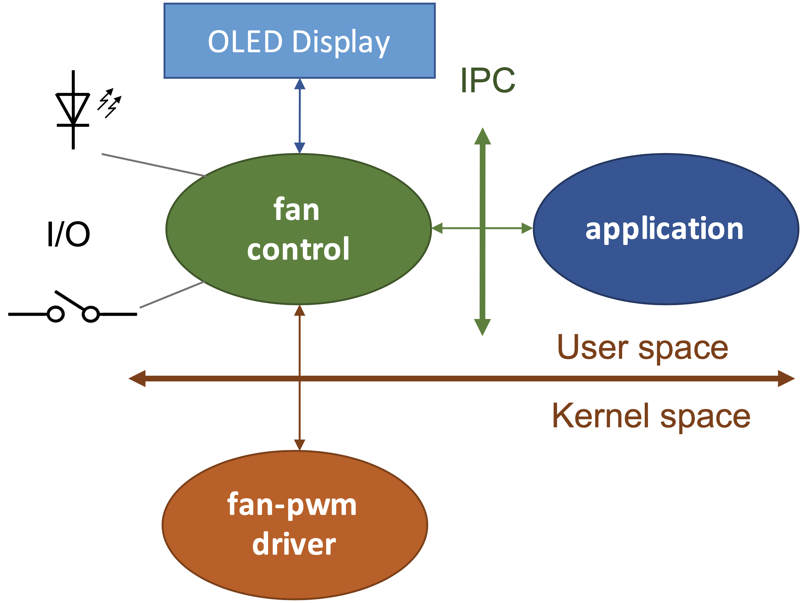

# fanless_fancontrol
Simulating Fan Speed Control Using LED Blinking on NanoPi NEO Plus2

Dissipating the heat generated by the processor and its peripherals is a critical aspect to consider when designing embedded systems. Natural convection cooling is ideal but may not always be sufficient. In such cases, a forced cooling system will complement it and ensure the proper functioning of the equipment. The project focuses on implementing an embedded system under Linux with a specific emphasis on kernel programming, device drivers, and multitasking applications. The goal is to simulate fan speed control based on CPU temperature using an embedded Linux platform.

 

